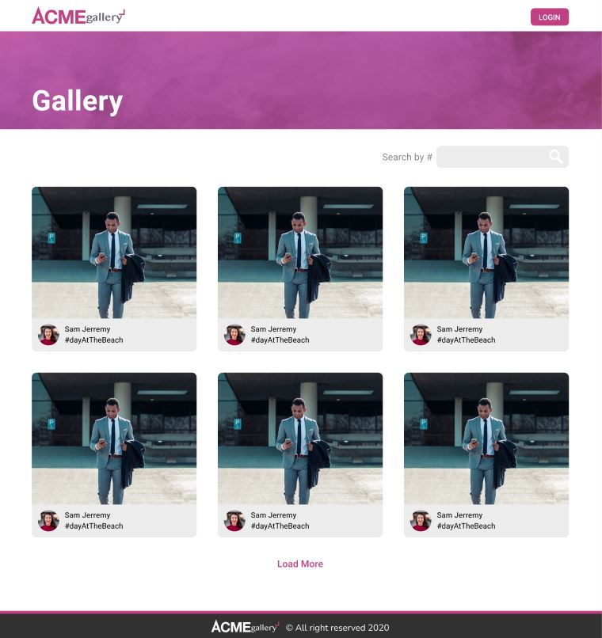

## We do Web Challenge

#### What is the challenge?

layout the provided design in [Figma](https://www.figma.com/file/qqqsnpBqQZpz50mpdTuwEP/ACMEgallery?node-id=206%3A85)

### Available commands

| Command      |                     Description                      |
| :----------- | :--------------------------------------------------: |
| npm run dev  |                starts the aplitaction                |
| npm run test | Runs unittesting with jest and react-testing-library |

### Testing the project

We can access to the demo: [here](https://wdw-challenge.netlify.app/)

### Pages

| Route | Description |
| :---- | :---------: |
| /     |  Home page  |

### Features/technologies used

`ViteJS`: A very fast option for the size of the requested project.  
`Typescript`: The project is typed with Typescript interfaces and types.  
`Sass`: A style sheet was created for each component  
`Bootstrap 5`: Some components and classes from bootstrap was used for create custom components.  
`Netlify`: To deploy App.

### Unit Testing

#### Jest and @testing-library

All components and hooks are tested with snapshot and testing library.

### Things to do/improve (In spanish)

- Para comenzar, la consigna pedia utilizar bootstrap y sass, pero si no estuviera especificado no hubiera usado ambas, quizas descartaria bootstrap, ya que el uso que le di es casi nulo, quizas por interpretar mal la consigna.
- Se podrian modular mas algunos componentes como la card, pudiendole agregar un header, body y footer para utilizar en otros casos.
- En mi caso para este tipo de proyectos donde hay que definir una paleta de colores, fonts y demas me gusta mucho usar la libreria de ChakraUI que ademas te facilita una gran de componentes muy adaptables y te permite manejar las media-query de una manera super sencilla.
- La información de la galeria ahora quedo mockeada pero podria llamarse a una API tranquilamente con un poco mas de tiempo, o utilizar una base serverless como json-server que mockea las api, y eso ya dejaria todo preparado para una futuro integración a un server.
- Crear un componente Icono que utilice el mismo svg y el tamaño y color sea parametrizable.
